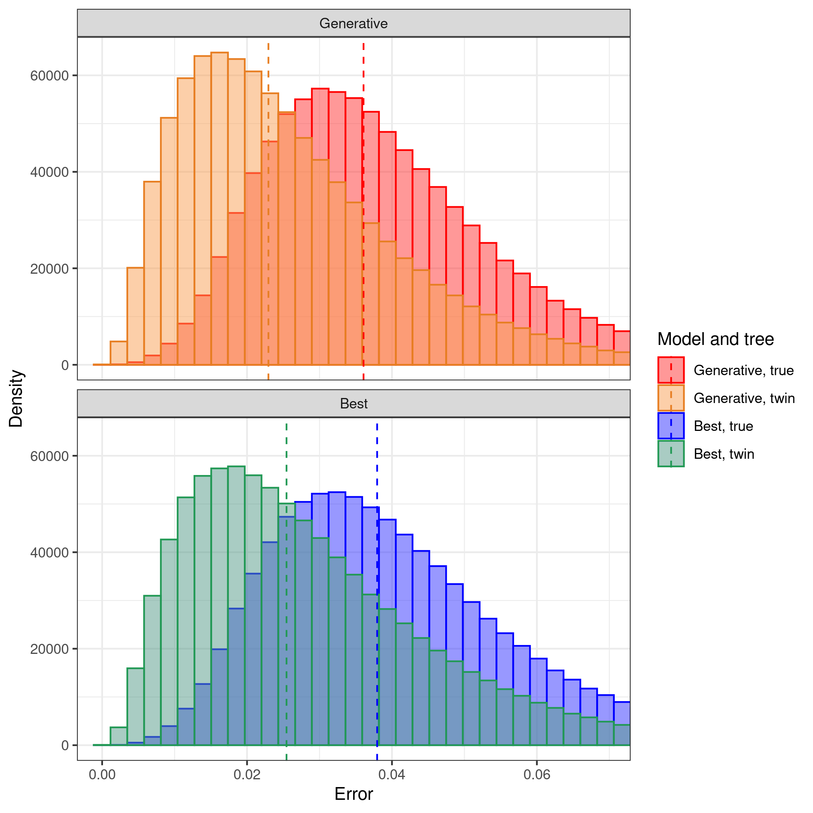

# pirouette_example_18

Branch   |[](https://travis-ci.org)                                                                                                 |[](https://appveyor.com)                                                                                               
---------|--------------------------------------------------------------------------------------------------------------------------------------------------------------|-----------------------------------------------------------------------------------------------------------------------------------------------------------------------------------------------
`master` |[](https://travis-ci.org/richelbilderbeek/pirouette_example_18) |[](https://ci.appveyor.com/project/richelbilderbeek/pirouette-example-18/branch/master)
`develop`|[](https://travis-ci.org/richelbilderbeek/pirouette_example_18)|[](https://ci.appveyor.com/project/richelbilderbeek/pirouette-example-18/branch/develop)

A [pirouette example](https://github.com/richelbilderbeek/pirouette_examples).

## Running on Peregrine

Install `pirouette` using the [peregrine](https://github.com/richelbilderbeek/peregrine)
bash and R scripts.

Then, in the main folder of this repo, type:

```
sbatch scripts/rerun.sh
```

## Related settings

 * [TODO]

## Results



